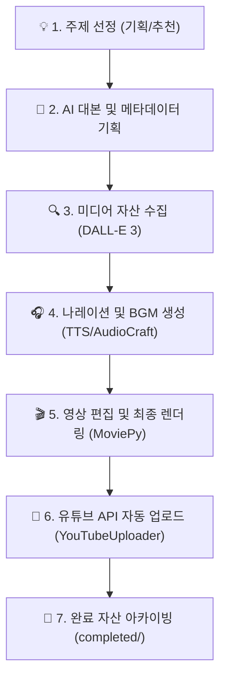

# 🤖 쇼츠 비디오 엔드투엔드 자동화 파이프라인 지침서 (Shorts Automation Skill Guide)

본 지침서는 기획 주제 입력 한 번으로 영상 생성부터 유튜브 채널 최종 게시까지 사람의 개입 없이 진행되는 **완전 자동화 파이프라인**의 아키텍처와 운영법을 정의한 스킬 가이드입니다.

---

## ⚙️ 자동화 파이프라인 아키텍처 (Automation Architecture)

Chronos AI 자동화 파이프라인은 아래의 순서로 실행되며, 각 모듈이 상호작용하여 비디오를 자동 업로드합니다.

---

## 🛠️ 자동화 핵심 컴포넌트 정보

### 1. 자동 업로드 연동 모듈 (`src/youtube_uploader.py`)
*   **인증 흐름 (OAuth 2.0)**:
    *   프로젝트 루트 디렉토리의 [client_secrets.json](file:///c:/Users/gubin/workspace/workspace_code/client_secrets.json)을 활용해 초기 로그인 세션을 획득합니다.
    *   인증 정보는 로컬 쿠키/토큰 격리 파일인 `youtube_token.pickle`에 영구 보관되며, 토큰 만료 시 자동으로 Refresh 토큰을 사용해 재연동을 시도하므로 **최초 1회 인증 후 무인 무정지 구동**이 가능합니다.
*   **업로드 API 연동**:
    *   Google APIs Client Library (`googleapiclient.discovery`)를 통해 YouTube Data API v3를 호출합니다.
    *   청크 단위(Chunked Resumable Upload) 스트리밍 업로드를 지원하여, 고화질 영상 파일도 네트워크 끊김 없이 안정적으로 업로드합니다.

### 2. 무인 백그라운드 스케줄링 및 파이프라인 통합 (`generate_video_v2.py`)
*   `run_pipeline`의 최종 단계에서 `client_secrets.json` 파일의 존재 여부를 동적으로 체크합니다.
*   파일이 존재하고 `--no-upload` 플래그가 지정되지 않은 경우, 렌더링 완료 즉시 비동기로 `YouTubeUploader`가 호출되어 즉각적인 채널 게시 작업을 이어받습니다.
*   업로드가 성공하면 소스 영상 파일(`.mp4`) 및 SEO 최적화 메타데이터 파일(`.json`)을 자동으로 `completed/` 폴더로 이동(shutil)하여 **자동화 큐의 무결성을 유지**합니다.

---

## 📈 문제 해결 및 문제 조치법 (Troubleshooting)

### 1. 구글 ADC / Credentials 만료 에러
*   **현상**: `Your default credentials were not found` 또는 토큰 갱신 실패 에러 발생 시.
*   **조치**:
    1. 프로젝트 루트의 `youtube_token.pickle` 파일을 삭제합니다.
    2. 개발자 터미널에서 `.venv\Scripts\python.exe src\youtube_uploader.py`를 단독 실행합니다.
    3. 자동으로 열리는 브라우저 창에서 사용할 유튜브 계정으로 구글 로그인을 수행하면 새로운 인증 캐시가 생성됩니다.

### 2. 일일 API 할당량 초과 에러
*   **현상**: `The request cannot be completed because you have exceeded your \ quota.` 메시지 수신.
*   **조치**: 유튜브 API 기본 무료 할당량(일일 10,000 유닛, 동영상 업로드 1개당 약 1,600 유닛 소모로 일일 약 6개 제한)을 초과한 경우입니다. 필요 시 Google Cloud Console에서 YouTube Data API의 Quota 한도 증설 신청을 하거나, 다른 클라이언트 ID로 `client_secrets.json`을 교체하여 구동합니다.
