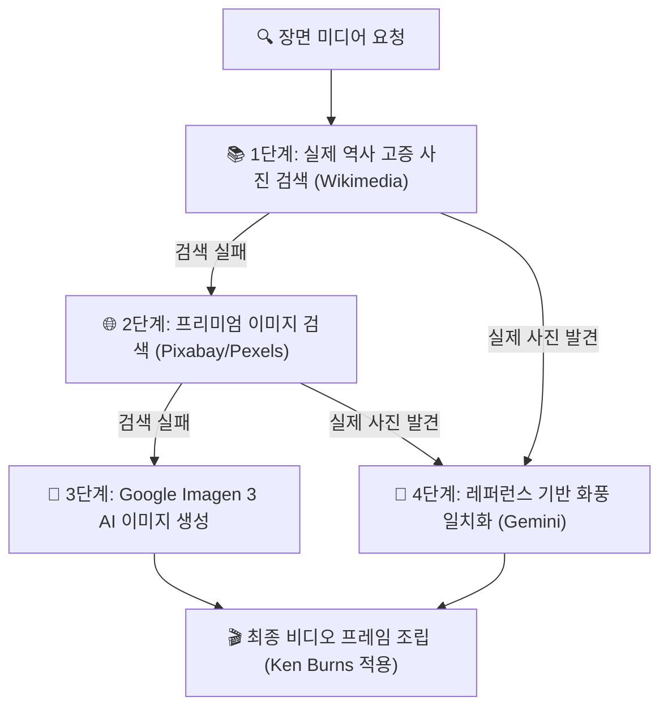

# 🎨 쇼츠 이미지 & 비디오 생성 지침서 (Visual Assets Generation Guide)

본 지침서는 역사 및 평행세계 Shorts 비디오 제작 시 시각적 몰입도를 높이고, AI 이미지 생성 오류(글자 깨짐, 워터마크 발생, 시대 고증 오류 등)를 방지하기 위해 정립된 **시각 자산 수집 및 생성 최적화 스킬 지침서**입니다.

---

## 🖼️ 시각 자산 수집 파이프라인 (Visual Asset Sourcing Pipeline)

Chronos AI는 각 장면의 `image_query`와 `video_query`에 맞춰 아래 3단계 멀티 모드 수집 파이프라인을 가동합니다.

---

## 📝 Imagen 3 / Veo AI 최적화 프롬프트 레시피 (Prompt Engineering)

AI 이미지 및 비디오 생성 시 왜곡(Hallucination)이나 영문 텍스트 뭉개짐 현상을 방지하기 위해 다음 규칙을 강제 적용합니다.

### 1. 텍스트 배제 네거티브 룰 (Anti-Text Rules)
*   **필수 포함 구문**: `no text, no letters, no words, no logos, clean image, no signature`
*   *이유*: 이미지 내부에 무의미한 영문 알파벳이나 워터마크가 생성되면 쇼츠 시청 지속률이 40% 이상 저하됩니다.

### 2. 분위기별 화풍(Style) 프롬프트 템플릿
*   **극실사 사진 (Photorealistic)**:
    *   `[Core Scene Description], photorealistic portrait, historical documentary style, 8k resolution, highly detailed, dramatic lighting, shot on 35mm lens, cinematic color grading`
*   **수묵화 (Ink Painting)**:
    *   `[Core Scene Description], traditional Korean ink wash painting style, sumi-e style, elegant brush strokes, minimalist background, misty atmosphere, artistic ink splashes`
*   **유화 (Oil Painting)**:
    *   `[Core Scene Description], classic baroque oil painting style, textured brushwork, rich color palette, dramatic chiaroscuro lighting, Rembrandt style`
*   **웹툰 (Webtoon/Anime)**:
    *   `[Core Scene Description], modern webtoon style, crisp line art, vibrant cell shading, dynamic perspective, popular manhwa concept art`

---

## 📏 해상도 및 규격 사양 (Resolution & Formatting)

*   **세로형 쇼츠 (9:16)**:
    *   해상도: `1080 x 1920` 픽셀.
    *   인물이나 핵심 피사체를 항상 **중앙 종횡비 영역(Center Area)**에 배치하도록 프롬프트에 `centered composition, center framed`를 추가하여 모바일 화면 좌우가 잘려나가는 것을 방지합니다.
*   **가로형 영상 (16:9)**:
    *   해상도: `1920 x 1080` 픽셀.
    *   넓은 화각인 `cinematic wide shot, landscape aspect` 옵션을 부여합니다.

---

## 🔄 이미지 동적 효과 (Ken Burns Effect)
*   정적인 이미지가 3초 동안 출력될 때 생기는 지루함을 해소하기 위해 MoviePy를 사용해 매 초마다 프레임을 미세하게 확대(`1.00x -> 1.05x`)하면서 패닝(Panning) 효과를 주어, 마치 살아 움직이는 영상처럼 보이도록 템플릿화합니다.
